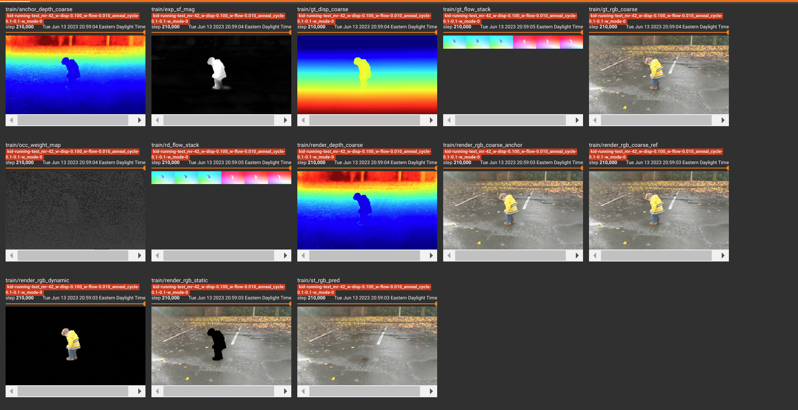

This is not an officially supported Google product.

# DynIBaR: Neural Dynamic Image-Based Rendering

### [Project Page](https://dynibar.github.io/)

Implementation for CVPR 2023 paper (best paper honorable mention)

[DynIBaR: Neural Dynamic Image-Based Rendering, CVPR 2023](https://dynibar.github.io/)<br>

[Zhengqi Li](https://zhengqili.github.io/)<sup>1</sup>, [Qianqian Wang](https://www.cs.cornell.edu/~qqw/)<sup>1,2</sup>, [Forrester Cole](https://people.csail.mit.edu/fcole/)<sup>1</sup>, [Richard Tucker](https://research.google/people/RichardTucker/)<sup>1</sup>, [Noah Snavely](https://www.cs.cornell.edu/~snavely/)<sup>1</sup>
<br><br>
<sup>1</sup>Google Research, <sup>2</sup>Cornell Tech, Cornell University  \
<br>

## Instructions for installing dependencies

### Python Environment

The following codebase was successfully run with Python 3.8 and CUDA 11.3. We
suggest installing the library in a virtual environment such as Anaconda.

To install required libraries, run: \
`conda env create -f environment_dynibar.yml`

To install softmax splatting for preprocessing, clone and install the library
from [here](https://github.com/hperrot/splatting).

To measure LPIPS, copy "models" folder from
[NSFF](https://github.com/zhengqili/Neural-Scene-Flow-Fields/tree/main/nsff_exp/models),
and put it in the code root directory.

## Evaluation on Nvidia Dynamic scene dataset.

### Downloading data and pretrained checkpoint

We include pretrained checkpoints that can be accessed by running:

```
wget https://storage.googleapis.com/gresearch/dynibar/nvidia_checkpoints.zip
unzip nvidia_checkpoints.zip
```

put the unzipped "checkpoints" folder in the code root directory.

Each scene in the Nvidia dataset can be accessed
[here](https://drive.google.com/drive/folders/1Gv6j_RvDG2WrpqEJWtx73u1tlCZKsPiM?usp=sharing)

The input data directory should similar to the following format:
xxx/nvidia_long_release/Balloon1

Run the following command for each scene to obtain reported quantitative results:

```bash
  # Usage: In txt file, You need to change "rootdir" to your code root directory,
  # and "folder_path" to input data directory, and make sure "coarse_dir" points to
  # "checkpoints" folder you unzip.
  python eval_nvidia.py --config configs_nvidia/eval_balloon1_long.txt
```

Note: It will take ~8 hours to evaluate each scene with 4x Nvidia A100 GPUs.

## Training/rendering on monocular videos.

### Required inputs and corresponding folders or files:

We provide a template input data for the NSFF example video, which can
be downloaded
[here](https://drive.google.com/file/d/1t6VLtcdxITFcdm9fi9SSFOiHqgHu9wdP/view?usp=sharing)

The input data directory should be in the following format:
xxx/release/kid-running/dense/***

For your own video, you need to include the following folders to run training.

*   disp: disparity maps from
    [dynamic-cvd](https://github.com/google/dynamic-video-depth). Note that you
    need to run test.py to save the disparity and camera parameters to the disk.
*   images_wxh: resized images at resolution w x h.
*   poses_bounds_cvd.npy: camera parameters of input video in LLFF format.

    You can generate the above three items with the following script:

    ```bash
      # Usage: data_dir is input video directory path,
      # cvd_dir is saved depth directory resulting from running
      # "test.py" at https://github.com/google/dynamic-video-depth
      python save_monocular_cameras.py \
      --data_dir xxx/release/kid-running \
      --cvd_dir xxx/kid-running_scene_flow_motion_field_epoch_20/epoch0020_test
    ```

*   source_virtual_views_wxh: virtual source views used to improve training
    stability and rendering quality (used in monocular video only). Running
    the following script to obtain them:

    ```bash
    # Usage: data_dir is input video directory path,
    # cvd_dir is saved depth direcotry resulting from running
    # "test.py" at https://github.com/google/dynamic-video-depth
    python render_source_vv.py \
     --data_dir xxx/release/kid-running \
     --cvd_dir xxx/kid-running_scene_flow_motion_field_epoch_20/epoch0020_test
    ```

*   flow_i1, flow_i2, flow_i3: estimated optical flows within temporal window of
    length 3. You can follow prior NSFF
    [script](https://github.com/zhengqili/Neural-Scene-Flow-Fields/blob/main/nsff_scripts/run_flows_video.py)
    to run optical flows between the frame i and its nearby frames i+1, i+2,
    i+3, and save them in folders "flow_i1", "flow_i2", "flow_i3" respectively.
    For example, 00000_fwd.npz in folder "flow_i1" stores forward flow and valid
    mask from frame 0 to frame 1, and 00000_bwd.npz stores backward flow and
    valid mask from frame 1 to frame 0.

*   static_masks, dynamic_masks: motion masks indicating which region is
    stationary or moving. You can perform morphological dilation and erosion operations respectively
    to ensure static_masks sufficeintly cover the regions of moving objects, and the regions from dynamic_masks 
    are within the true regions of moving objects.
    (Note: due to dependency reason, we don't release code to generate the masks. Instead you could use [script](https://github.com/zhengqili/Neural-Scene-Flow-Fields/blob/main/nsff_scripts/run_flows_video.py#L87) from NSFF to generate coarse masks for your usage)
    
### To train the model:

```bash
  # Usage: config is config txt file for training video
  # make sure "rootdir" is your code root directory,
  # "folder_path" is your input data directory path,
  # "train_scenes" is your folder name.
  # For example, if data is in xxx/release/kid-running/dense/, then "train_scenes" is 
  # "xxx/release/", "train_scenes" is "kid-running"
  python train.py \
  --config configs/train_kid-running.txt
```

Hyperparameters in config txt file you might need to know for training a good model on in-the-wild videos
* rootdir: code root directory, should be in format: YOUR_PATH/dynibar
* folder_path: data root directory, 
* N_rand: number of random samples at each iterations. Try to set it as large as possible, typically > 3000 gives good results
* init_decay_epoch: number of epochs to linaerly decay the data-driven depth and optical flow losses. Modify this such that num_video_frames * init_decay_epoch = 30~40K 
* max_range, num_source_views: max_range indicates maximum search frame ranges to select source views for static model. num_source_views*2 is number of source views used for static model.

The tensorboard includes rendering visualization as shown below.



### To render the model:

```bash
  # Usage: config is config txt file for training video,
  # please make sure expname in txt is the saved folder name in 'out' directory
  python render_monocular_bt.py \
  --config configs/test_kid-running.txt
```

### Contact

For any questions related to our paper and implementation,
please send email to zhengqili@google.com.

## Citation

```
@InProceedings{Li_2023_CVPR,
    author    = {Li, Zhengqi and Wang, Qianqian and Cole, Forrester and Tucker, Richard and Snavely, Noah},
    title     = {DynIBaR: Neural Dynamic Image-Based Rendering},
    booktitle = {Proceedings of the IEEE/CVF Conference on Computer Vision and Pattern Recognition (CVPR)},
    month     = {June},
    year      = {2023},
    pages     = {4273-4284}
}
```
